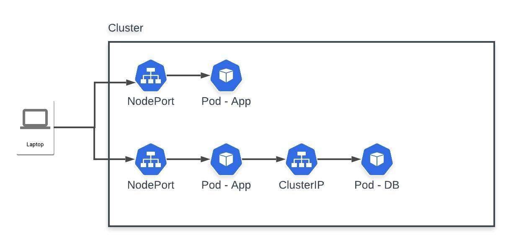
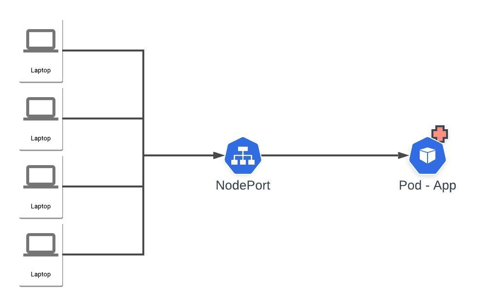
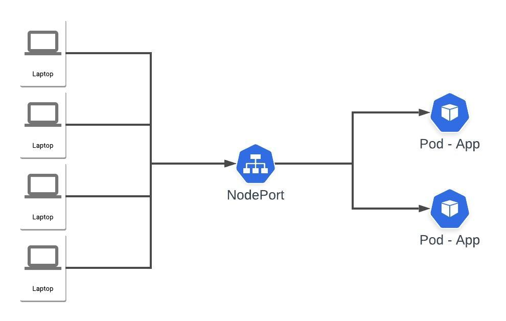

# Infraestrutura da Aplicação

Descrição de como planejar a infraestrutura da aplicação Node API com Mysql.

## Orquestrador de containers - Kubernetes

A aplicação foi desenvolvida utilizando imagens do Node e Mysql em docker. Com isso é possível automatizar todo o deploy de uma aplicação usando ferramentas como Kubernetes, que irá fazer o trabalho de gerenciar seus containers, tomando decisões definidas pelo Engenheiro DevOps.

Para ter uma infraestrutura de alta disponibilidade, é necessário garantir que todo o processo desde o desenvolvimento e o deploy seja automatizado, usando de forma declarativa as configurações de sua infraestrutura, otimizando tempo e custo.

Para a infra do Node API, a seguinte estrutura pode ser usada:

Podemos entender que:

1. A criação de um Cluster Kubernetes
2. A aplicação Node API pode ter duas instâncias, sendo executada cada uma dentro de um Pod
3. Para o acesso aos Pods, cria-se dois serviços do tipo NodePort, visto que deve ter acesso externo
4. Para o banco de dados, temos um Pod com o Mysql
5. Para o acesso ao Pod do Mysql, cria-se um serviço do tipo ClusterIP que seu acesso só é possível dentro do Cluster, não tendo acesso externo.

## Escalando a aplicação

O Kubernetes contém um recurso chamado de **Horizontal Pod Autoscaler**, que é capaz de escalar automaticamente o número de Pods de um deployment, replica set e se baseia no uso da CPU e outras métricas que podem ser customizadas.

Em base do exemplo acima, se o número de requisições aumentar e o Pod começar a consumir recursos a mais que o normal e esse recurso ultrapassar o definido pelo Engenheiro DevOps, o Horizontal Pod Autoscaler irá entrar em ação e criar Pods conforme o necessário, em base do uso do recurso de CPU por exemplo, ele consegue calcular quantos Pods deve ser criado para que a quantidade de requisições atuais possam ser atendidas sem nenhum tipo de problema para aplicação e mantendo sua disponibilidade.

*Imagem de vários acessos ao mesmo tempo e a saúde do Pod comprometida, podendo causar instabilidades no sistema*

*Imagem após o recurso de Autoscaler identificar a necessidade de criar novos Pods para que mantenha a estabilidade no sistema*

Da mesma forma que é possível escalar novos Pods quando os recursos do mesmo estão em consumo muito alto, o Horizontal Pod Autoscaler irá identificar quando o consumo diminuir, dessa forma os Pods que foram criados para suportar o aumento de requisições serão destruídos e somente os Pods já predefinidos ficarão no ar.

Dessa forma, o custo para se manter uma aplicação no ar será otimizado visto que somente quando necessário novos recursos serão adicionados, caso contrário, somente os recursos necessários estarão em uso.

## Integração contínua / Entrega contínua

A integração contínua consiste em ter uma integração maior entre os códigos desenvolvidos pela equipe. Para isso é necessário ter em mente que seu código deve conter testes automatizados, para que essa integração possa ocorrer de uma forma segura e eficiente.

A entrega contínua consiste em validar todo o processo de integração e garantir que seu código esteja pronto para subir em produção. Além dos testes já realizados durante a integração contínua, esse passo pode conter outros testes complementares e é essencial que sejam executados de uma forma rápida.

### Ferramentas

Algumas ferramentas que podem ajudar nesse proesso:

1. Gitlab
2. Github

O Gitlab e Github além de serem repositórios de códigos, também é possível criar pipelines para sua aplicação. Para cada commit realizado e enviado ao repositório, essa pipeline será executada e de forma automatizada irá rodar seus testes e entre outras validações.

3. Jenkis

Com o Jenkis é possível criar builds da aplicação, versionamentos, realizar testes automatizados entre outras automatizações. O acesso ao Jenkins é feito via web, sendo que qualquer pessoa com permissão possa executar suas próprias tarefas.

> Por ter um conhecimento muito teórico desses casos, não detalhei tecnicamente sobre os assuntos.

